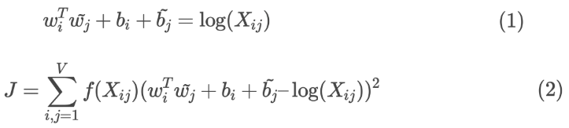
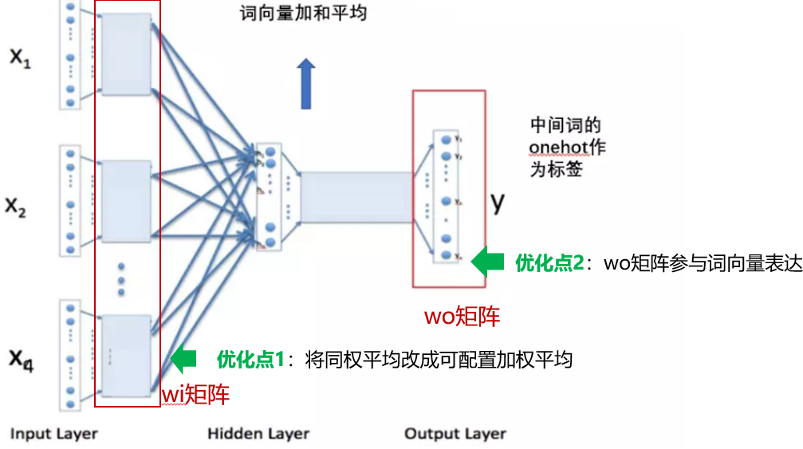

# fastText中文词向量训练调优
本工具基于最新版本fastText，针对于fastText训练中文词向量存在的一些问题，尝试训练输出一份更优质的中文词向量。

## 背景

fastText训练词向量的方式同其余词向量训练工具(如gensim)的最大区别在于引入了subword ngram embedding机制。该机制会将词拆解成subword学习其embedding，在英文场景下该方式可以学习如ing，en，sub等词根的语义，对于中文而言可以实现字向量建模。该方法不仅能够学习出更精细的词向量，还能有效应对未登录词(UNK)。该方式下，最终词向量除包含词本身的embedding外还加权了subword ngram embedding。

然而在引入subword ngram embedding的情况下，会出现词向量表达太过注重字面而非语义的情况，最终效果往往不如gensim等其他工具训练的词向量。这一点不少人都有提及[1]，比如’交易’的相似词汇gensim给出的是’买卖’，而fastText给出的是’交易法’。这里主要原因在于fastText最终的词向量采用了average-pooling融合word embedding和subword ngram embedding，无差别的avg-pool让字向量的权重过高。就拿"交易"这个词为例，FastText最终得到的词向量为：1/3*(w2v("交易")+c2v("交")+c2v("易"))，w2v("交易")只占了1/3的权重。

## 优化点

针对上述问题进行了两方面调优：


1 对fastText subword ngram embedding增加非均匀加权训练和融合方式

通过对训练阶段&梯度计算阶段&词向量计算阶段进行修改，以实现非均匀加权训练和融合方式，提升词向量部分的权重。此处注意仅仅修改词向量计算阶段的加权逻辑是不够的，还需要改写训练阶段&梯度计算阶段的avg-pool方式，改写梯度分配方式，同时整体权重需要在这三个阶段统一，这样才不会造成冲突导致不理想的结果。具体需要针对cbow和skipgram两种训练词向量的接口分别进行修改，主要修改逻辑在Fasttext和Model这两个模块中，同时为了做到可配置，还需要修改Args模块中部分逻辑。


2 融合fastText的wi,wo两个参数矩阵作为词向量的表达

该思路参考GloVe训练词向量的方法，这里简单介绍一下。GloVe基于矩阵分解的原理，可以参照下边的公式。公式(1)表达了词向量和共现矩阵之间的关系，Xij表示单词i出现在单词j的上下文中的次数,w和˜w是我们要求解的词向量，其中w表征词本身的向量，˜w是词作为context时的向量。公式(2)是GloVe训练词向量的loss function。可以看到公式(1)(2)本身对于w,˜w是对称的，两者均能够反映词语义。GloVe不对w和˜w使用同一套参数是为了在更新参数的时候能够简单套用SGD，但原论文经过试验发现将两个向量加权融合效果最好[2]。

 

同理如下图，fasttext训练词向量也有两套参数，wi,wo两个矩阵。wi矩阵是wordvec lookup embedding layer的参数，wo矩阵是词向量模型CBOW的softmax layer参数。由于训练词向量时label数量等同于词表数，所以wo也可以作为词向量的间接表达。

 

许多NLP任务中会将softmax层的参数同输入embedding共享权重以提升效果[3]，对于fasttext训练词向量的模型结构体现为wi wo共享一套参数。此处fastText不这么做的原因之一是出于灵活性考虑，由于fastText训练词向量可以选择使用层次softmax或negative sampling，并且fastText除了训练词向量还做文本分类任务。当进行文本分类任务或使用层次softmax时，wo均不能对应到word embedding上。因此fasttext只使用wi矩阵作为词向量的表达。

但目前negative sampling是更主流的方式，也是fasttext的默认选择。并且通过实际测试在此情况下，wo对于词义的表达效果优异，因此这里通过加权的方式将wi和wo融合起来作为最终的词向量表达。


综上，总结本工具的修改点：
1) 提供对wi的word embedding和char ngram embedding非均匀加权的能力。包括改写训练阶段的avg-pool为加权avg-pool，改写梯度分配，改写词向量计算的avg-pool。
2) 融合fastText的wi,wo两部分参数矩阵输出词向量 
3) 提供一个配套的测试方法和词向量输出方法，对比评估原版词向量和优化后词向量的nn结果，输出优化后的词向量文件。
4) 为了方便使用char ngram embedding，提供一个输出全量char embedding的方法。 


 

## 使用方法

安装方式同社区版fastText相同。训练模型时主要添加额外参数：

1） factor(default 0)，该参数表明对word emb的加权权重，factor=2表示word emb的加权权重是其余ngram emb的2倍。 factor越大，模型对word emb的训练权重也越大，ngram emb/char emb的权重越小。该参数控制了词向量在语义和字面匹配之间的权衡。

2） addWo(default 0)，该参数设置最终词向量使用wo矩阵的占比，默认0同社区版fasttext相同，即wo不参与最终词向量的计算。addWo=1时，wo矩阵无衰减参与最终词向量的表达。


为了方便测试项目附带了一个数据集test_data.zip，解压后得到training_m.data，一个很小的中文问答数据集，我已经预先分词了可以直接作为fasttext的输入。

一个推荐的训练参数为：./fasttext skipgram -input training_m.data -output model_opt -minn 1 -maxn 1 -factor 5 -addWo 0.5。

为了对比使用默认参数训练一个模型作为对比：./fasttext skipgram -input training_m.data -output model_raw -minn 1 -maxn 1。默认参数下得到的模型同社区版直接训练的结果是一致的。

此处minn和maxn的参数都设置为1，即仅使用中文字向量，这适用于大部分中文词向量的训练，因为中文词不像英文单词由大量char构成，因此minn=maxn=1保证只使用1-gram 


## 效果对比评估

数据集使用公开小语料集training_m.data。

./fasttext cbow -input training_m.data -output model_github_f3 -minn 1 -maxn 1 -factor 3 -addWo 0.5 –saveSubwords 

```python
Query word? 西瓜

FastText社区版结果: 梨瓜 0.844742, 瓜甜 0.844272, 小白瓜 0.843321, 瓜小 0.842737, 白瓜 0.84237, 甜瓜 0.841364, 草莓 0.836499, 瓜地 0.834303, 毛桃 0.829545, 红瓜 0.828329, 樱桃 0.820445, 梨子 0.819515, 桃子 0.819322, 南瓜 0.818245, 香瓜 0.816097, 瓜来 0.808185, 瓜风 0.807967, 新瓜 0.806315, 好瓜 0.800812, 哈密瓜 0.799502

优化后结果: 樱桃 0.74255,草莓 0.739563,桃子 0.71918,毛桃 0.703168,香蕉 0.681815,梨子 0.673798,南瓜 0.673665,香瓜 0.664742,甜瓜 0.664255,橙子 0.658326,栗子 0.644542,菠萝 0.638454,哈密瓜 0.632669,葡萄 0.631035,桃 0.628979,橘子 0.626813,提子 0.625782,油桃 0.620282,芒果 0.617898,山竹 0.616846

Query word? 加油

FastText社区版结果: 加油站 0.971877，油品 0.941719，多油 0.930839，石油制品 0.928971，沾油 0.927911，中油 0.926959，成品油 0.926658，中海油 0.924278，润滑油 0.915403，采油厂 0.91532，油中 0.914417，石油化工 0.914154，油车 0.913131，黑油 0.91071，油用 0.90978，重油 0.90666，皇油 0.905959，油料 0.904441，燃料油 0.899085，华油 0.897942

优化后结果: 加油站 0.923967，油品 0.886256，汽车 0.865934，中海油 0.864016，中交兴路 0.852408，高速公路 0.852128，中油 0.842843，能源 0.837739，丰田 0.836257，货运 0.83583，天然气 0.835378，运输 0.833673，机动车 0.833374，集装箱 0.832191，增亮 0.830869，石油化工 0.830293，道路 0.828654，服务区 0.828507，中化 0.828421，出租汽车 0.827987

Query word? 卡车

FastText社区版结果: 重卡 0.86966, 商用车 0.851596, 货运卡车 0.842577, 工程车 0.834881, 车哈 0.83052, 汽车库 0.828365, 盖车 0.826508, 车连 0.824976, 车铃 0.823329, 吉车 0.817193, 车利 0.816975, 主车 0.816882, 挂车 0.815685, 汽车连 0.815299, 货运车 0.814872, 卡车司机 0.814706, 车联车 0.81211, 北奔 0.811808, 全车件 0.811699, 汽服车 0.810652

优化后结果: 重卡 0.803677, 商用车 0.745328, 北奔 0.732565, 工程机械 0.711415, 挂车 0.711144, 工程车 0.704977, 搅拌车 0.703909, 全车件 0.693837, 轻卡 0.686301, 陕汽 0.682731, 半挂 0.682687, 重汽 0.678995, 重型车 0.678515, 豪沃 0.676985, 中重型 0.666689, 重型汽车 0.661953, 自卸车 0.660423, 潍柴 0.66014, 自卸 0.659467, 斯堪尼亚 0.656314
```

可以看出原版fasttext对于subword字向量的权重太高，导致kNN的结果中出现不少字面匹配的奇怪词汇。相比之下优化后的结果能够更好的捕捉语义上的相似。

```python
Query word? 设力电水

raw nn result: 水力发电 0.955116 水电工程 0.938073 电力设施 0.936371 水利水电 0.934946 水电 0.932844 电气设备 0.930651 电力设备 0.92831 电热水壶 0.924837 电子设备 0.918199 动力电池 0.917339 水电厂 0.916507 给排水 0.906473 电气化 0.904282 工作电压 0.901277 电力供应 0.898887 电气工程 0.891474 电力 0.889327 水力 0.889142 水泵 0.888578 火电 0.888568

modified nn result: 模具设计 0.803418 给排水 0.783797 专项规划 0.776928 概预算 0.76388 民用建筑 0.751938 建筑安装 0.747173 避雷器 0.745086 工程施工 0.742018 压力容器 0.732734 变流器 0.726955 网络工程 0.726204 工程力学 0.722571 微机 0.720962 专用设备 0.719909 幕墙 0.719507 仪器仪表 0.717032 工区 0.717014 水泵 0.716801 水路运输 0.716449 污水处理 0.716447
```
对于一个混乱词汇” 设力电水”，fasttext依然能够给出词向量表达(如果使用gensim词向量，这种词汇会被标识为UNK无法给出embedding表达)，通过良好的捕捉字面量的语义，弥补了词向量表征的不足。而优化后的版本没有丧失这一特性，达到了字向量和词向量相辅相成的良好效果。

<br> 
<br> 


Ref:

[1] 如何评价Word2Vec作者提出的fastText算法 https://www.zhihu.com/question/48345431/answer/119566296

[2] Jeffrey Pennington, Richard Socher, and Christopher D. Manning. 2014. Glove: Global vectors for
word representation. In Empirical Methods in Natural Language Processing (EMNLP)

[3] Ofir Press and Lior Wolf. Using the output embedding to improve language models. arXiv preprint arXiv:1608.05859, 2016

<br> 
<br>   
<br>
<br> 
<br>   
<br>

***

<br>
    
以下摘录社区版内容：
# fastText
[fastText](https://fasttext.cc/) is a library for efficient learning of word representations and sentence classification.

[](https://circleci.com/gh/facebookresearch/fastText/tree/master)

## Table of contents

* [Resources](#resources)
   * [Models](#models)
   * [Supplementary data](#supplementary-data)
   * [FAQ](#faq)
   * [Cheatsheet](#cheatsheet)
* [Requirements](#requirements)
* [Building fastText](#building-fasttext)
   * [Getting the source code](#getting-the-source-code)
   * [Building fastText using make (preferred)](#building-fasttext-using-make-preferred)
   * [Building fastText using cmake](#building-fasttext-using-cmake)
   * [Building fastText for Python](#building-fasttext-for-python)
* [Example use cases](#example-use-cases)
   * [Word representation learning](#word-representation-learning)
   * [Obtaining word vectors for out-of-vocabulary words](#obtaining-word-vectors-for-out-of-vocabulary-words)
   * [Text classification](#text-classification)
* [Full documentation](#full-documentation)
* [References](#references)
   * [Enriching Word Vectors with Subword Information](#enriching-word-vectors-with-subword-information)
   * [Bag of Tricks for Efficient Text Classification](#bag-of-tricks-for-efficient-text-classification)
   * [FastText.zip: Compressing text classification models](#fasttextzip-compressing-text-classification-models)
* [Join the fastText community](#join-the-fasttext-community)
* [License](#license)

## Resources

### Models
- Recent state-of-the-art [English word vectors](https://fasttext.cc/docs/en/english-vectors.html).
- Word vectors for [157 languages trained on Wikipedia and Crawl](https://github.com/facebookresearch/fastText/blob/master/docs/crawl-vectors.md).
- Models for [language identification](https://fasttext.cc/docs/en/language-identification.html#content) and [various supervised tasks](https://fasttext.cc/docs/en/supervised-models.html#content).

### Supplementary data
- The preprocessed [YFCC100M data](https://fasttext.cc/docs/en/dataset.html#content) used in [2].

### FAQ

You can find [answers to frequently asked questions](https://fasttext.cc/docs/en/faqs.html#content) on our [website](https://fasttext.cc/).

### Cheatsheet

We also provide a [cheatsheet](https://fasttext.cc/docs/en/cheatsheet.html#content) full of useful one-liners.

## Requirements

We are continuously building and testing our library, CLI and Python bindings under various docker images using [circleci](https://circleci.com/).

Generally, **fastText** builds on modern Mac OS and Linux distributions.
Since it uses some C++11 features, it requires a compiler with good C++11 support.
These include :

* (g++-4.7.2 or newer) or (clang-3.3 or newer)

Compilation is carried out using a Makefile, so you will need to have a working **make**.
If you want to use **cmake** you need at least version 2.8.9.

One of the oldest distributions we successfully built and tested the CLI under is [Debian jessie](https://www.debian.org/releases/jessie/).

For the word-similarity evaluation script you will need:

* Python 2.6 or newer
* NumPy & SciPy

For the python bindings (see the subdirectory python) you will need:

* Python version 2.7 or >=3.4
* NumPy & SciPy
* [pybind11](https://github.com/pybind/pybind11)

One of the oldest distributions we successfully built and tested the Python bindings under is [Debian jessie](https://www.debian.org/releases/jessie/).

If these requirements make it impossible for you to use fastText, please open an issue and we will try to accommodate you.

## Building fastText

We discuss building the latest stable version of fastText.

### Getting the source code

You can find our [latest stable release](https://github.com/facebookresearch/fastText/releases/latest) in the usual place.

There is also the master branch that contains all of our most recent work, but comes along with all the usual caveats of an unstable branch. You might want to use this if you are a developer or power-user.

### Building fastText using make (preferred)

```
$ wget https://github.com/facebookresearch/fastText/archive/v0.9.1.zip
$ unzip v0.9.1.zip
$ cd fastText-0.9.1
$ make
```

This will produce object files for all the classes as well as the main binary `fasttext`.
If you do not plan on using the default system-wide compiler, update the two macros defined at the beginning of the Makefile (CC and INCLUDES).

### Building fastText using cmake

For now this is not part of a release, so you will need to clone the master branch.

```
$ git clone https://github.com/facebookresearch/fastText.git
$ cd fastText
$ mkdir build && cd build && cmake ..
$ make && make install
```

This will create the fasttext binary and also all relevant libraries (shared, static, PIC).

### Building fastText for Python

For now this is not part of a release, so you will need to clone the master branch.

```
$ git clone https://github.com/facebookresearch/fastText.git
$ cd fastText
$ pip install .
```

For further information and introduction see python/README.md

## Example use cases

This library has two main use cases: word representation learning and text classification.
These were described in the two papers [1](#enriching-word-vectors-with-subword-information) and [2](#bag-of-tricks-for-efficient-text-classification).

### Word representation learning

In order to learn word vectors, as described in [1](#enriching-word-vectors-with-subword-information), do:

```
$ ./fasttext skipgram -input data.txt -output model
```

where `data.txt` is a training file containing `UTF-8` encoded text.
By default the word vectors will take into account character n-grams from 3 to 6 characters.
At the end of optimization the program will save two files: `model.bin` and `model.vec`.
`model.vec` is a text file containing the word vectors, one per line.
`model.bin` is a binary file containing the parameters of the model along with the dictionary and all hyper parameters.
The binary file can be used later to compute word vectors or to restart the optimization.

### Obtaining word vectors for out-of-vocabulary words

The previously trained model can be used to compute word vectors for out-of-vocabulary words.
Provided you have a text file `queries.txt` containing words for which you want to compute vectors, use the following command:

```
$ ./fasttext print-word-vectors model.bin < queries.txt
```

This will output word vectors to the standard output, one vector per line.
This can also be used with pipes:

```
$ cat queries.txt | ./fasttext print-word-vectors model.bin
```

See the provided scripts for an example. For instance, running:

```
$ ./word-vector-example.sh
```

will compile the code, download data, compute word vectors and evaluate them on the rare words similarity dataset RW [Thang et al. 2013].

### Text classification

This library can also be used to train supervised text classifiers, for instance for sentiment analysis.
In order to train a text classifier using the method described in [2](#bag-of-tricks-for-efficient-text-classification), use:

```
$ ./fasttext supervised -input train.txt -output model
```

where `train.txt` is a text file containing a training sentence per line along with the labels.
By default, we assume that labels are words that are prefixed by the string `__label__`.
This will output two files: `model.bin` and `model.vec`.
Once the model was trained, you can evaluate it by computing the precision and recall at k (P@k and R@k) on a test set using:

```
$ ./fasttext test model.bin test.txt k
```

The argument `k` is optional, and is equal to `1` by default.

In order to obtain the k most likely labels for a piece of text, use:

```
$ ./fasttext predict model.bin test.txt k
```

or use `predict-prob` to also get the probability for each label

```
$ ./fasttext predict-prob model.bin test.txt k
```

where `test.txt` contains a piece of text to classify per line.
Doing so will print to the standard output the k most likely labels for each line.
The argument `k` is optional, and equal to `1` by default.
See `classification-example.sh` for an example use case.
In order to reproduce results from the paper [2](#bag-of-tricks-for-efficient-text-classification), run `classification-results.sh`, this will download all the datasets and reproduce the results from Table 1.

If you want to compute vector representations of sentences or paragraphs, please use:

```
$ ./fasttext print-sentence-vectors model.bin < text.txt
```

This assumes that the `text.txt` file contains the paragraphs that you want to get vectors for.
The program will output one vector representation per line in the file.

You can also quantize a supervised model to reduce its memory usage with the following command:

```
$ ./fasttext quantize -output model
```
This will create a `.ftz` file with a smaller memory footprint. All the standard functionality, like `test` or `predict` work the same way on the quantized models:
```
$ ./fasttext test model.ftz test.txt
```
The quantization procedure follows the steps described in [3](#fasttextzip-compressing-text-classification-models). You can
run the script `quantization-example.sh` for an example.


## Full documentation

Invoke a command without arguments to list available arguments and their default values:

```
$ ./fasttext supervised
Empty input or output path.

The following arguments are mandatory:
  -input              training file path
  -output             output file path

The following arguments are optional:
  -verbose            verbosity level [2]

The following arguments for the dictionary are optional:
  -minCount           minimal number of word occurrences [1]
  -minCountLabel      minimal number of label occurrences [0]
  -wordNgrams         max length of word ngram [1]
  -bucket             number of buckets [2000000]
  -minn               min length of char ngram [0]
  -maxn               max length of char ngram [0]
  -t                  sampling threshold [0.0001]
  -label              labels prefix [__label__]

The following arguments for training are optional:
  -lr                 learning rate [0.1]
  -lrUpdateRate       change the rate of updates for the learning rate [100]
  -dim                size of word vectors [100]
  -ws                 size of the context window [5]
  -epoch              number of epochs [5]
  -neg                number of negatives sampled [5]
  -loss               loss function {ns, hs, softmax} [softmax]
  -thread             number of threads [12]
  -pretrainedVectors  pretrained word vectors for supervised learning []
  -saveOutput         whether output params should be saved [0]

The following arguments for quantization are optional:
  -cutoff             number of words and ngrams to retain [0]
  -retrain            finetune embeddings if a cutoff is applied [0]
  -qnorm              quantizing the norm separately [0]
  -qout               quantizing the classifier [0]
  -dsub               size of each sub-vector [2]
```

Defaults may vary by mode. (Word-representation modes `skipgram` and `cbow` use a default `-minCount` of 5.)

## References

Please cite [1](#enriching-word-vectors-with-subword-information) if using this code for learning word representations or [2](#bag-of-tricks-for-efficient-text-classification) if using for text classification.

### Enriching Word Vectors with Subword Information

[1] P. Bojanowski\*, E. Grave\*, A. Joulin, T. Mikolov, [*Enriching Word Vectors with Subword Information*](https://arxiv.org/abs/1607.04606)

```
@article{bojanowski2017enriching,
  title={Enriching Word Vectors with Subword Information},
  author={Bojanowski, Piotr and Grave, Edouard and Joulin, Armand and Mikolov, Tomas},
  journal={Transactions of the Association for Computational Linguistics},
  volume={5},
  year={2017},
  issn={2307-387X},
  pages={135--146}
}
```

### Bag of Tricks for Efficient Text Classification

[2] A. Joulin, E. Grave, P. Bojanowski, T. Mikolov, [*Bag of Tricks for Efficient Text Classification*](https://arxiv.org/abs/1607.01759)

```
@InProceedings{joulin2017bag,
  title={Bag of Tricks for Efficient Text Classification},
  author={Joulin, Armand and Grave, Edouard and Bojanowski, Piotr and Mikolov, Tomas},
  booktitle={Proceedings of the 15th Conference of the European Chapter of the Association for Computational Linguistics: Volume 2, Short Papers},
  month={April},
  year={2017},
  publisher={Association for Computational Linguistics},
  pages={427--431},
}
```

### FastText.zip: Compressing text classification models

[3] A. Joulin, E. Grave, P. Bojanowski, M. Douze, H. Jégou, T. Mikolov, [*FastText.zip: Compressing text classification models*](https://arxiv.org/abs/1612.03651)

```
@article{joulin2016fasttext,
  title={FastText.zip: Compressing text classification models},
  author={Joulin, Armand and Grave, Edouard and Bojanowski, Piotr and Douze, Matthijs and J{\'e}gou, H{\'e}rve and Mikolov, Tomas},
  journal={arXiv preprint arXiv:1612.03651},
  year={2016}
}
```

(\* These authors contributed equally.)


## Join the fastText community

* Facebook page: https://www.facebook.com/groups/1174547215919768
* Google group: https://groups.google.com/forum/#!forum/fasttext-library
* Contact: [egrave@fb.com](mailto:egrave@fb.com), [bojanowski@fb.com](mailto:bojanowski@fb.com), [ajoulin@fb.com](mailto:ajoulin@fb.com), [tmikolov@fb.com](mailto:tmikolov@fb.com)

See the CONTRIBUTING file for information about how to help out.

## License

fastText is MIT-licensed.
